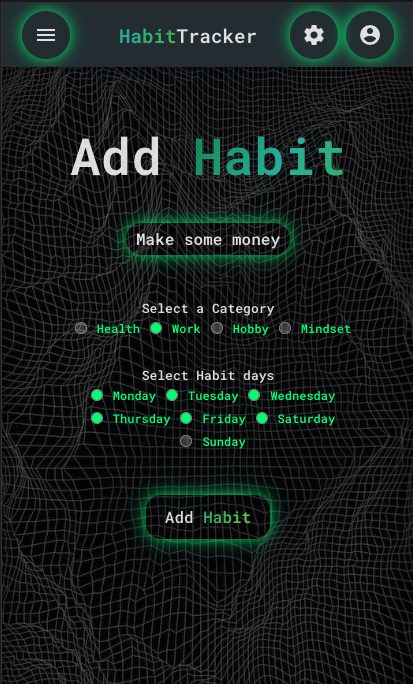
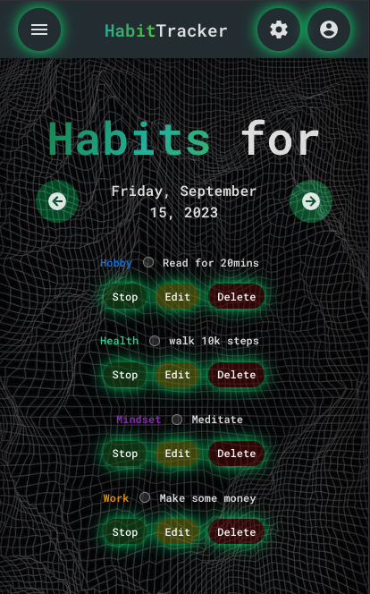
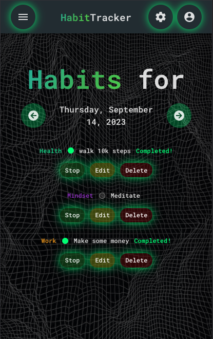
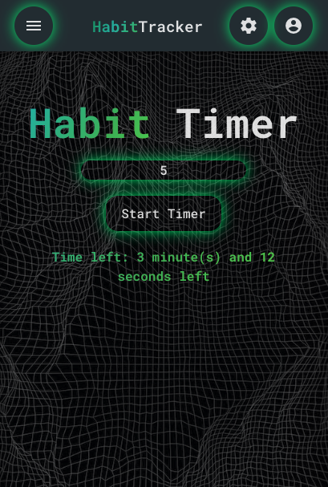
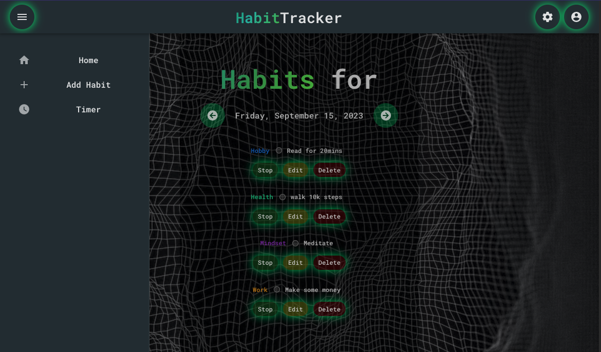

# Habit Tracker

Habit Tracker is an application that assists users in monitoring and tracking their weekly habits. Built with modern technologies, it offers a responsive and intuitive user experience.

## Table of Contents

- [Introduction](#introduction)
- [Features](#features)
- [Tech Stack](#tech-stack)
- [Screenshots](#screenshots)
- [Dependencies](#dependencies)
- [Future Features](#future-features)
- [Acknowledgments](#acknowledgments)

## Introduction

Habit Tracker is designed to offer a seamless interface to add, monitor, and manage daily habits. Whether it's practicing a musical instrument, drinking enough water, or reading a chapter of a book, Habit Tracker has got you covered.

## Features

- **Habit Management**: The core feature allows users to efficiently add, monitor, and manage daily habits.
  
  - **Editing**: Easily modify the name of any habit.
  - **Stopping a Habit**: Pause any habit temporarily.
  - **Deleting a Habit**: Remove any habit that's no longer needed.

- **Category Assignment**: Organize habits with categories.
- **Active Days Selection**: Choose specific days for each habit.
- **Historical View**: Reflect on past accomplishments.
- **Upcoming Habits Preview**: Plan and prepare for the future.
- **Timer Functionality**: For time-bound habits.

## Tech Stack

- **Vue 3** with Composition API: Reactive and composable component logic.
- **Vite**: Efficient and fast frontend tooling.
- **Pinia**: Intuitive state management.
- **Vuetify**: Stylish UI components.
- **SCSS**: Enhanced styling capabilities.
- **Vue Router**: Effective routing and navigation.
- **MDI Icons**: Diverse icon library.

## Screenshots

## Dependencies

For a detailed understanding of the packages and libraries, see the `package.json`. Some primary dependencies include:

- Vue 3
- Vuetify
- Vue Router
- Pinia
- Vite
- SCSS
- MDI Icons
- ESLint, StyleLint & Prettier

## Future Features

- **User Settings Page**: Customize user preferences.
- **Profile Page**: Add a personal touch to your tracking experience.
- **Habit Calendar**: Monthly habit overview.
- **Heatmap Calendar**: Visual consistency representation.
- **Dark/Light Mode**: Theme customization for comfort.

